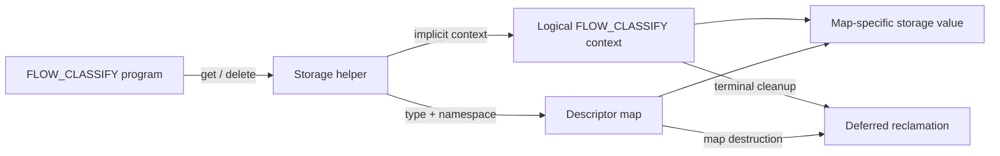

# FLOW_CLASSIFY local storage proposal

## Pre-authoring analysis

### Resolved ambiguities

| Area | Decision |
| --- | --- |
| API model | Use a local-storage map as a type and sharing descriptor while netebpfext stores values on the logical FLOW_CLASSIFY context. |
| Program scope | Restrict V1 to `EBPF_PROGRAM_TYPE_FLOW_CLASSIFY`, covering both STREAM and DATAGRAM attach types. |
| Storage identity | Store at most one value per descriptor-map instance per logical FLOW_CLASSIFY context. |
| Access | Permit BPF programs to access values; user mode may manage the descriptor map but cannot read or modify per-flow values. |
| Helper model | Follow Linux local-storage semantics and use the current FLOW_CLASSIFY context as an implicit helper argument. |
| Lifetime | Retain values for the logical, reference-counted FLOW_CLASSIFY lifecycle, including DELETED processing and retained asynchronous continuations. |
| Sharing | Programs intentionally share a value by referencing the same descriptor-map instance. Different maps remain isolated. |
| Concurrency | Make lookup, creation, deletion, and reclamation race-safe. Do not implicitly synchronize accesses to value contents. |
| Naming | Use `BPF_MAP_TYPE_FLOW_CLASSIFY_STORAGE` because the lifetime and access contract are specific to FLOW_CLASSIFY. |

### Remaining ambiguities

| ID | Area | Status |
| --- | --- | --- |
| FCS-OI-001 | Resource accounting and capacity controls | [UNKNOWN] Requires eBPF-for-Windows team guidance. |
| FCS-OI-002 | Integration with the custom-map framework | [UNKNOWN] Requires eBPF-for-Windows team guidance. |
| FCS-OI-003 | Numeric map type and helper identifiers | [UNKNOWN] Assign during implementation. |
| FCS-OI-004 | Maximum supported value size | [UNKNOWN] Resolve with the resource model and verifier constraints. |

### Accepted assumptions

- FLOW_CLASSIFY provides a logical per-flow context spanning NEW, data, and DELETED callbacks.
- A future asynchronous FLOW_CLASSIFY extension can retain that context while an operation is pending.
- eBPF-for-Windows continues to provide source-level compatibility with generally applicable Linux eBPF APIs.
- The existing implicit-context mechanism can provide the current FLOW_CLASSIFY context to helper implementations.

## Summary

This proposal adds storage whose lifetime follows a logical FLOW_CLASSIFY context. It allows a
FLOW_CLASSIFY program to retain bounded, typed state across STREAM segments or DATAGRAM callbacks
without maintaining a separate map keyed by `flow_id`.

The proposed `BPF_MAP_TYPE_FLOW_CLASSIFY_STORAGE` map defines the value type and sharing namespace.
The map does not key values by `flow_id`. Instead, netebpfext attaches each lazily allocated value to
the current logical FLOW_CLASSIFY context. Values are reclaimed automatically when either the
FLOW_CLASSIFY context or the descriptor map is destroyed.

The API follows the Linux object-local-storage model represented by `BPF_MAP_TYPE_SK_STORAGE`, while
using the current FLOW_CLASSIFY context instead of a Linux socket.

## Motivation

Programs that inspect a flow across multiple callbacks need state for incremental parsing, counters,
classification progress, or other flow-local decisions. An ordinary hash map keyed by `flow_id` can
provide this state, but it has several limitations:

- The map must be sized before flows arrive.
- Each access requires a key construction and map lookup.
- Programs must delete entries on every terminal path.
- Cleanup races can retain stale entries until a reused identifier addresses them.
- Storage lifetime is not intrinsically tied to the FLOW_CLASSIFY lifecycle.

Embedding a fixed scratch region in the public FLOW_CLASSIFY context would avoid a map lookup, but it
would impose one size and schema on every consumer, waste memory for flows that do not use storage,
and create unclear sharing rules for multiple attached programs.

FLOW_CLASSIFY local storage provides lazy allocation, automatic lifecycle cleanup, verifier-known
value bounds, and explicit sharing through normal map identity.

## Goals

- Provide typed mutable storage across callbacks for one logical FLOW_CLASSIFY context.
- Support STREAM and DATAGRAM attach types through the same API.
- Allocate storage only when a program requests it.
- Reclaim storage automatically with the FLOW_CLASSIFY context or descriptor map.
- Let normal map references express intentional sharing between programs.
- Preserve verifier bounds for direct access to the returned value.
- Prevent access to another flow by identifier.

## Non-goals

- Storage shared with SOCK_OPS, SOCK_ADDR, XDP, or other program types.
- Storage that remains alive for the entire WFP flow after FLOW_CLASSIFY has stopped.
- User-mode lookup, update, or deletion of individual per-flow values.
- Access to storage by supplying an arbitrary `flow_id`.
- Implicit serialization of FLOW_CLASSIFY callbacks or value accesses.
- Automatic eviction of existing values.
- Replacement of ordinary maps used for cross-hook or user-mode correlation.

## Terminology

| Term | Meaning |
| --- | --- |
| Descriptor map | A `BPF_MAP_TYPE_FLOW_CLASSIFY_STORAGE` map that defines value size, type, and sharing identity. |
| Logical FLOW_CLASSIFY context | The reference-counted netebpfext state that spans callbacks while classification or retained asynchronous work remains active. |
| Storage value | One mutable value associated with one descriptor map and one logical FLOW_CLASSIFY context. |
| Current flow | The FLOW_CLASSIFY context for the program invocation that calls a storage helper. |

## Requirements

| ID | Requirement | Acceptance criterion |
| --- | --- | --- |
| REQ-FCS-001 | The platform MUST provide `BPF_MAP_TYPE_FLOW_CLASSIFY_STORAGE`. | A map of this type can be created and associated with a FLOW_CLASSIFY program. |
| REQ-FCS-002 | The map type MUST be rejected for program types other than `EBPF_PROGRAM_TYPE_FLOW_CLASSIFY`. | Association tests reject every non-FLOW_CLASSIFY program type. |
| REQ-FCS-003 | Each descriptor map MUST identify at most one storage value per logical FLOW_CLASSIFY context. | Repeated successful lookups through the same map and context return the same value. |
| REQ-FCS-004 | Different descriptor maps MUST identify independent values on the same context. | Writes through one map do not change a value obtained through another map. |
| REQ-FCS-005 | Storage creation MUST be lazy. | A context that never requests a value has no allocation for that descriptor map. |
| REQ-FCS-006 | Storage creation MUST initialize the complete value from the supplied initial value or with zeroes. | Tests verify byte-for-byte initialization for both forms. |
| REQ-FCS-007 | A program MUST NOT select a flow by `flow_id` or another caller-supplied identifier. | The BPF-visible helpers accept no flow identifier and operate only on the current implicit context. |
| REQ-FCS-008 | A successful lookup MUST return a mutable pointer bounded by the descriptor map's value size. | The verifier permits in-bounds access and rejects out-of-bounds access. |
| REQ-FCS-009 | A returned pointer MUST remain valid only for the current program invocation and until the value is explicitly deleted. | The verifier and runtime prevent retained or post-delete pointer use. |
| REQ-FCS-010 | NEW and data callbacks MUST permit lookup, creation, and deletion. | STREAM and DATAGRAM tests exercise all three operations in both callback states. |
| REQ-FCS-011 | DELETED callbacks MUST permit lookup and deletion but MUST reject creation. | Existing state is visible during cleanup, while create requests fail without allocating memory. |
| REQ-FCS-012 | Storage MUST remain available while the logical FLOW_CLASSIFY context is retained. | Values survive consecutive callbacks and a simulated retained continuation. |
| REQ-FCS-013 | Storage MUST be reclaimed before the logical context permits `flow_id` reuse. | Teardown tests observe value destruction before context identity retirement. |
| REQ-FCS-014 | Destroying a descriptor map MUST reclaim its values from all live FLOW_CLASSIFY contexts. | Map-destruction tests leave no reachable value or allocation. |
| REQ-FCS-015 | Concurrent lookup and creation MUST install at most one value for a map and context pair. | Stress tests observe one installed value and no leaked losing allocation. |
| REQ-FCS-016 | The platform MUST NOT imply synchronization for reads or writes within a returned value. | Documentation and concurrency tests require programs to use supported atomic operations or external ordering. |
| REQ-FCS-017 | Allocation or capacity failure MUST return `NULL` without evicting an existing value. | Exhaustion tests preserve existing values and return `NULL` for the failed create operation. |
| REQ-FCS-018 | User-mode map CRUD operations MUST NOT expose individual per-flow values. | User-mode lookup, update, enumeration, and delete operations for values are rejected. |

## API

### Descriptor map

The following declaration is illustrative. Resource fields depend on the selected capacity model.

```c
struct flow_state
{
    uint64_t bytes_seen;
    uint32_t phase;
};

struct
{
    __uint(type, BPF_MAP_TYPE_FLOW_CLASSIFY_STORAGE);
    __type(key, int);
    __type(value, struct flow_state);
    // map_flags and max_entries depend on FCS-OI-001.
} flow_state_map SEC(".maps");
```

The key type is present for compatibility with local-storage map metadata. BPF programs do not
supply a key to the storage helpers. The current logical FLOW_CLASSIFY context is the effective key.

User mode may create, pin, share, and close the descriptor map through normal map-object APIs.
These operations manage the descriptor map, not individual storage values.

### Helper functions

```c
EBPF_HELPER(
    void*,
    bpf_flow_classify_storage_get,
    (void* map, const void* initial_value, uint64_t flags));

EBPF_HELPER(
    int64_t,
    bpf_flow_classify_storage_delete,
    (void* map));
```

Both helpers receive the current FLOW_CLASSIFY context through the existing hidden
`implicit_context` argument. The BPF-visible API cannot name another flow.

### Get semantics

`bpf_flow_classify_storage_get()` follows Linux local-storage lookup and creation semantics:

- `flags == 0` performs lookup without creation.
- `BPF_LOCAL_STORAGE_GET_F_CREATE` creates the value when it does not exist.
- Unsupported flags fail.
- If creation is requested and `initial_value` is non-NULL, the helper copies exactly the descriptor
  map's value size.
- If creation is requested and `initial_value` is NULL, the helper zero-initializes the complete
  value.
- If the value already exists, the helper returns it and does not apply `initial_value`.
- If lookup does not find a value and creation was not requested, the helper returns `NULL`.
- If allocation or a selected capacity limit prevents creation, the helper returns `NULL`.
- Creation during a DELETED callback returns `NULL`.

On success, the verifier treats the result as a nullable map-value pointer bounded by the descriptor
map's declared value size.

### Delete semantics

`bpf_flow_classify_storage_delete()` removes the value identified by the descriptor map and current
FLOW_CLASSIFY context.

- The helper returns zero after successfully unlinking a value.
- The helper returns a nonzero error if no value exists or the arguments are invalid.
- A successful delete makes the value unavailable to later lookups.
- A pointer returned before deletion must not be dereferenced after successful deletion.
- Reclamation is deferred until no in-progress invocation can access the unlinked value.

## Architecture



The descriptor map supplies verifier metadata and a stable sharing identity. netebpfext owns the
per-flow value and links it to the logical FLOW_CLASSIFY context. The eBPF core retains normal
ownership of the descriptor map object and its references.

## Sharing and isolation

Programs that reference the same descriptor-map instance intentionally share one value on a flow.
This includes tail-call targets and separately loaded programs that reuse a pinned map. Updates from
an earlier program invocation are visible to later invocations that use the same map.

Programs that declare or open different descriptor maps receive different values, even when their
value layouts are identical. The platform does not add a hidden per-program or per-link namespace.

## Lifecycle

| Event | Storage behavior |
| --- | --- |
| FLOW_CLASSIFY NEW | Lookup, lazy creation, and deletion are permitted. |
| STREAM or DATAGRAM data | The value is reused across callbacks; lookup, creation, and deletion are permitted. |
| Program returns ALLOW | The value remains while the logical context and descriptor map remain live. It is reclaimed if no classification or retained work remains. |
| Program returns BLOCK | Active programs receive required cleanup callbacks, then ordinary values are reclaimed. A minimal blocked-flow marker does not retain program storage. |
| FLOW_CLASSIFY DELETED | Existing values remain visible for cleanup. Creation is rejected. |
| Asynchronous retention | A future pend mechanism retains the logical context and its values until completion, timeout, cancellation, or deletion cleanup. |
| Logical context destruction | All remaining values attached to the context are unlinked and reclaimed. |
| Descriptor map destruction | Values belonging to that map are unlinked from every live context and reclaimed. |

The storage lifetime is not the entire underlying WFP flow lifetime. It ends when FLOW_CLASSIFY has
no remaining active classification or retained asynchronous work. Keeping values until WFP deletes
the flow would retain memory after programs can no longer access it.

For connectionless traffic, one WFP flow may carry multiple datagrams for a remote tuple. Lazy
creation therefore normally allocates once per inspected WFP flow and descriptor map, not once per
datagram. High-cardinality one-shot traffic can still produce many short-lived allocations.

## Concurrency

The provider makes value lookup, creation, unlinking, map destruction, context destruction, and
deferred reclamation race-safe.

Concurrent create requests for the same descriptor map and context install exactly one value.
Callers must not depend on which competing `initial_value` wins. Existing values are never replaced
by `get`.

The returned value is ordinary mutable BPF memory. The provider does not serialize FLOW_CLASSIFY
callbacks and does not lock value contents. Programs must use supported atomic operations or rely on
a separately defined callback-ordering guarantee when concurrent access is possible.

## Resource management

Values reside in nonpaged kernel memory and are allocated lazily. Existing values are never evicted
to satisfy a new allocation. The following capacity models require upstream selection.

### Available-memory model (Option 1)

Match Linux local-storage map metadata: require `BPF_F_NO_PREALLOC`, require `max_entries == 0`, and
rely on allocation failure when nonpaged memory is unavailable.

Pros:

- Closest source and behavioral compatibility with Linux local storage.
- No arbitrary per-map capacity that consumers must estimate.
- Matches existing netebpfext flow-context allocation behavior.

Cons:

- A program can request one value on every observed flow until system allocation fails.
- Operators cannot reserve capacity among descriptor maps.

### Per-map entry limit (Option 2)

Interpret `max_entries` as the maximum number of simultaneous values for that descriptor map.

Pros:

- Gives each consumer an explicit capacity.
- Bounds memory attributable to a map when combined with its value size.
- Matches the capacity model used by ordinary maps.

Cons:

- Diverges from Linux local-storage map semantics.
- Shared descriptor maps can exhaust capacity across otherwise independent programs.
- Programs must estimate peak concurrent inspected flows.

### Per-map limit with system byte quota (Option 3)

Apply the per-map limit and a netebpfext-wide byte quota for all FLOW_CLASSIFY storage values.

Pros:

- Bounds aggregate nonpaged memory across all consumers.
- Provides a system safety boundary independent of map configuration.

Cons:

- Adds global accounting and contention.
- Requires configuration, defaults, telemetry, and compatibility policy.
- A consumer can experience failure because unrelated maps exhausted the shared quota.

Regardless of the selected model, allocation failure returns `NULL`, does not evict existing values,
and does not silently create a success-shaped fallback.

## Custom-map integration

The descriptor map requires normal eBPF map identity and verifier metadata, but its values live in
netebpfext rather than in a core-owned key/value table. The following implementation options require
upstream selection.

### Provider-owned map without a base map (Option 1)

Extend the Map Information NPI so a custom map provider can specify
`base_map_type == BPF_MAP_TYPE_UNSPEC`. eBPF core owns the map object, references, metadata, and
pinning. netebpfext owns all per-flow values.

Pros:

- Directly represents the selected architecture.
- Avoids allocating an unused base hash table.
- Establishes a reusable fully custom-map mechanism.

Cons:

- Expands the current custom-map NPI and implementation scope.
- Requires new lifecycle and verifier integration tests.

### Hash-backed descriptor map (Option 2)

Register the map through the current custom-map framework using a hash base map, but use only the map
object and provider context as the storage descriptor.

Pros:

- Reuses the existing custom-map registration path.
- May reduce initial eBPF-core changes.

Cons:

- Maintains a base data structure that does not own the values.
- Makes `max_entries` and ordinary CRUD behavior harder to define.
- Risks coupling descriptor semantics to unused hash-map behavior.

### Core map implementation (Option 3)

Implement the map type directly in eBPF core and add a provider callback that resolves the current
FLOW_CLASSIFY owner.

Pros:

- Gives the verifier and map subsystem first-class knowledge of local storage.
- Can establish common infrastructure for future object-local storage types.

Cons:

- Pulls FLOW_CLASSIFY-specific integration into eBPF core.
- Requires a new core-to-extension ownership contract.
- Has the largest initial implementation scope.

## Verifier and runtime changes

The implementation must:

- Register the map type and restrict association to FLOW_CLASSIFY programs.
- Register both helpers as FLOW_CLASSIFY-specific helpers.
- Pass the current FLOW_CLASSIFY context through `implicit_context`.
- Validate that `map` is a `BPF_MAP_TYPE_FLOW_CLASSIFY_STORAGE` descriptor.
- Validate `initial_value` as NULL or readable memory of exactly the map value size when creation is
  requested.
- Return a nullable pointer whose accessible range is the descriptor map's value size.
- Reject use of a returned pointer after a successful delete.
- Support native, JIT, interpreter, and `bpf_prog_test_run_opts` execution paths.

The exact helper prototype metadata needed to bind the return range and optional initializer size to
the descriptor map is an implementation detail. It may require extending the verifier's helper
argument metadata.

## Error handling

`bpf_flow_classify_storage_get()` returns `NULL` for:

- A missing value when creation was not requested.
- Allocation failure.
- Capacity exhaustion under the selected resource model.
- Creation during DELETED.
- An invalid map type, context, initializer, or flag.

The nullable return follows existing map-lookup verifier patterns. Programs must test it before
dereferencing the value. Security-sensitive programs decide whether storage failure permits or
blocks traffic; the helper does not impose policy.

`bpf_flow_classify_storage_delete()` returns a nonzero error for an invalid map or context, or when
no value exists. Exact error-code mapping is assigned during implementation.

## Security considerations

- Values are zero-initialized or fully initialized before becoming visible.
- Helpers cannot address another flow by identifier.
- Different descriptor maps remain isolated.
- User mode cannot enumerate or modify live values.
- The verifier bounds every direct value access.
- Reclamation waits until in-progress invocations can no longer dereference the value.
- Allocation failure is observable and never causes reuse of another flow's value.
- Resource exhaustion behavior must be included in threat modeling for the selected capacity model.

## Performance considerations

- The first successful create allocates one value for a descriptor map and flow.
- Later callbacks reuse the value without a `flow_id` hash lookup.
- DATAGRAM processing does not allocate once per datagram after the value exists.
- Each context needs a structure that resolves descriptor-map identity to its values.
- Context and map destruction may unlink multiple values and should defer expensive reclamation when
  required by callback IRQL.
- The implementation should measure lookup cost against an ordinary hash map keyed by `flow_id`.

## Validation

The implementation must include:

- Map creation and program-association tests.
- Verifier tests for nullable checks, value bounds, initializer bounds, wrong map types, and
  post-delete access.
- STREAM and DATAGRAM tests for NEW, data, and DELETED behavior.
- Repeated-callback tests proving value persistence.
- Sharing tests using one descriptor map across programs and tail calls.
- Isolation tests using distinct descriptor maps with identical value layouts.
- Concurrent create, lookup, delete, context cleanup, and map cleanup stress tests.
- Allocation and capacity-failure tests for the selected resource model.
- Cleanup tests for ALLOW, BLOCK, flow deletion, program detach, map destruction, and `flow_id`
  retirement.
- Future asynchronous tests proving that retained contexts preserve values until terminal cleanup.
- Performance tests against an ordinary `flow_id`-keyed hash map.

## Alternatives

### Ordinary map keyed by `flow_id`

Programs store state in an existing hash or LRU map and perform explicit cleanup.

Pros:

- Requires no platform extension.
- Supports cross-hook and user-mode access.

Cons:

- Requires capacity planning, repeated key lookups, and explicit cleanup.
- Does not bind storage lifetime to FLOW_CLASSIFY.
- Can retain stale state when cleanup and identifier reuse are not ordered correctly.

### Fixed scratch region in the FLOW_CLASSIFY context

The public context includes a fixed mutable byte array.

Pros:

- Provides direct access without a helper lookup.
- Has simple provider ownership.

Cons:

- Imposes one size and schema on all consumers.
- Wastes memory for unused flows.
- Has unclear isolation and sharing across attached programs.
- Makes ABI growth difficult.

### Opaque helper-managed storage without a map

A helper uses a numeric namespace and requested size to allocate flow-local memory.

Pros:

- Avoids adding a map type.
- Can attach storage directly to the provider context.

Cons:

- Must invent namespace collision and sharing rules.
- Gives the verifier no existing map descriptor from which to derive value bounds.
- Recreates map-like type metadata through a separate registration mechanism.

## Open issues

| ID | Question | Options |
| --- | --- | --- |
| FCS-OI-001 | How is memory bounded? | Available memory; per-map `max_entries`; or per-map limits plus a system byte quota. |
| FCS-OI-002 | How is the descriptor map implemented? | Provider-owned map without a base map; hash-backed descriptor; or core map implementation. |
| FCS-OI-003 | Which numeric IDs are assigned? | Allocate the map type and helper IDs through the normal upstream process. |
| FCS-OI-004 | What maximum value size is supported? | Select a fixed platform limit or derive it from the chosen resource and verifier model. |

## References

- [FLOW_CLASSIFY hook proposal](FlowClassifyHook.md)
- [Custom maps design](CustomMaps.md)
- [eBPF extensions](eBpfExtensions.md)
- [Asynchronous processing proposal](AsyncProcessing.md)
- [Linux `BPF_MAP_TYPE_SK_STORAGE`](https://docs.kernel.org/bpf/map_sk_storage.html)

## Revision history

| Revision | Date | Change |
| --- | --- | --- |
| 0.1 | 2026-07-16 | Initial proposal generated from the interactive design decisions. |
